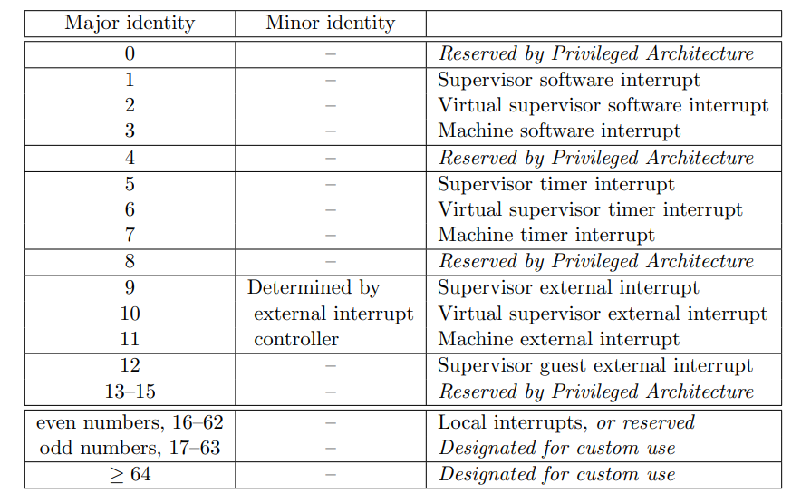

# 1 RISC-V PLIC

外设的中断信号通过 plic 中的各种逻辑后上报到 riscv hart，plic 的协议里甚至给了一个 plic 的硬件逻辑原理图：


## PLIC中断源

PLIC 理论支持多个任意中断源，每个中断源可以是不同触发类型，电平触发或者边沿触发，PLIC 为每个中断源分配了：

>* **Gateway/IP**
>
>  闸口将不同触发类型的外部中断（如电平触发、边沿触发等）转换成统一的内部中断请求，一次只发送一个请求，闸口启动屏蔽直到中断处理完成。（硬件在闸口发送内部中断请求后会将IP置高）
>
>* **ID**
>
>  从编号1起可以用来连接有效的外部中断源（一源一号），0表示不存在的中断，理论上支持任意多个。
>
>* **Priority**
>
>  每个中断源可以设置特定的优先级，其寄存器是存储器地址映射的可读可写寄存器。优先级的数字越大，优先级越高，0意味着不可能中断，相当于将中断源屏蔽。硬件实现时可以根据选择的优先级寄存器的有效位来确定可以支持的优先级数目。（每个中断目标可以设置优先级阈值，只有中断源优先级高于此阈值，中断才能被发给中断目标）
>
>* **IE**
>
>  每个中断源配置一个中断使能寄存器（IE），当其被编程置0，此中断源被中断目标屏蔽，置1则被打开。

## PLIC中断目标

plic中断目标通常是RISC-V架构的一个特定模式下的Hart（Hardware Thread：表示一个硬件线程。利用硬件超线程技术，可以在一个处理器核中实现多份hart。每套线程有自己独立的寄存器组等上下文资源，但是大多数运算资源被所有hart复用）

## PLIC中断处理

* **中断通知**

  中断源经过闸口发送，IE置为1，优先级大于0。从所有参与仲裁的中断源中选择优先级最高的，若优先级相同则选择编号最小的。仲裁出的中断源优先级高于中断目标的阈值，发往中断目标的中断通知是一根电平触发的中断线。（若中断目标是M mode，则中断线的值会反应在mip的MEIP域）

* **中断响应**
  中断目标收到中断通知后，读取一个 PLIC 实现的存储器地址映射的可读寄存器，PLIC 会返回中断源的 ID 编号，若为0，则无中断请求。PLIC 返回中断 ID 后，会将对应中断源的 IP 清0。

* **中断完成**
  中断目标完成中断处理操作后，将中断 ID 写入一个 PLIC 实现的存储器地址映射的可写寄存器，PLIC 接收到之后，将相应中断源的闸口解除屏蔽。

## 内核实现

中断控制器的初始化触发路径为：

```c
start_kernel
    	/* arch/riscv/kernel/irq.c */
	+-> init_IRQ
    		/* drivers/irqchip/irqchip.c */
    	+-> irqchip_init
    		+-> of_irq_init(__irqchip_of_table);
```

其中，`of_irq_init`  会在 DT 中扫描和初始化匹配的中断控制器。该函数将扫描 `__irqchip_of_table` 这个段以匹配中断控制器节点，并首先从父节点依次调用其初始化函数。

`__irqchip_of_table` 段中存放了若干个 `struct of_device_id` 静态常量，定义为：

```c
struct of_device_id 
{ 
    char    name[32];－－－－－－要匹配的device node的名字 
    char    type[32];－－－－－－－要匹配的device node的类型 
    char    compatible[128];－－－匹配字符串（DT compatible string），用来匹配适合的 device node 
    const void *data;－－－－－－－－对于PLIC，这里是初始化函数指针 
};
```

这个数据结构主要被用来进行 Device node 和 driver 模块进行匹配用的。从该数据结构的定义可以看出，在匹配过程中，device name、device type和DT compatible string都是考虑的因素。

`drivers/irqchip/irq-riscv-intc.c` 中有一个宏：

```c
IRQCHIP_DECLARE(riscv, "riscv,cpu-intc", riscv_intc_init);
```

这个宏其实就是初始化了一个 `struct of_device_id` 的静态常量，并放置在 `irqchip_of_table section` 中。在 linux kernel 编译的时候，你可以配置多个 irq chip 进入内核，编译系统会把所有的 IRQCHIP_DECLARE 宏定义的数据放入到一个特殊的 section 中（section name 是 irqchip_of_table），我们称这个特殊的 section 叫做 `irq chip table`。这个table 也就保存了 kernel 支持的所有的中断控制器的ID信息（最重要的是驱动代码初始化函数和 DT compatible string）。

of_irq_init 会扫描 dts 里所有的 interrupt controller 节点，并且按照最顶端的中断控制器依此向下遍历每个中断
控制器节点，调用其中的初始化函数。具体到 riscv 就是依此调用 riscv_intc_init、plic_init等。具体的调用过程：


接下来看 `riscv_intc_init/plic_init`：

* `riscv_intc_init`

  ```c
  riscv_intc_init
        /*
         * 初始化intc对应的irq domain, 在riscv64上为这个irq domain分了64个中断输入，
         * 这里的输入就是cpu core上对应的各种中断类型，比如M mode timer中断、S mode
         * 外部中断等。
         *
         * 这里并没有为每个具体的中断类型建立irq_desc以及建立硬件中断号到virq的映射，
         * 我们下面可以看到，直到有具体的用户时，才会建立对应的virq。
         */
    +-> irq_domain_add_linear
    +-> set_handle_irq
  ```

  这里分配了一个 `irq_domain` 数据结构来表示 intc，并将这个 irq domain 加入到了 irq domain list 链表。

  `set_handle_irq` 把 riscv_intc_irq 配置给 handle_arch_irq，从 entry.S 的分析可以知道，CPU 被中断时会跳到handle_arch_irq 执行，所以 riscv_intc_irq 就是 riscv 上中断处理的总入口。

* `plic_init`

  ```c
  __plic_init
        /*
         * 通过plic dts中的interrupts-extended得到中断context的个数，简单情况下，
         * 如果一个CPU core上有M mode external irq和S mode external irq，那么整个
         * 系统上plic的context个数就是核数乘2。
         */
    +-> nr_contexts = of_irq_count(node)
        /* 创建plic的irq domain */
    +-> irq_domain_add_linear
  
    +-> 针对每个context做如下迭代：
          /*
           * 找到plic的父节点，并调用irq_create_of_mapping，得到S mode external irq
           * 的virq，这个过程会分配对应的irq_desc。
           */
      +-> plic_parent_irq = irq_of_parse_and_map
        +-> irq_create_of_mapping
          /* 配置intc S mode外部中断对应的处理函数 */
      +-> irq_set_chained_handler(plic_parent_irq, plic_handle_irq)
  ```

  可以想象，一个中断连接到 plic 输入上的具体外设，应该是在外设对应的设备节点初始化的时候找见外设对应的 plic节点，在 plic irq domain 上创建外设中断对应的 irq_desc 以及 virq。外设驱动里通过 requst_irq 接口把外设的中断处理函数注册给 virq。

* `plic_handle_irq`

  ```c
  /*
   * Handling an interrupt is a two-step process: first you claim the interrupt
   * by reading the claim register, then you complete the interrupt by writing
   * that source ID back to the same claim register.  This automatically enables
   * and disables the interrupt, so there's nothing else to do.
   */
  static void plic_handle_irq(struct irq_desc *desc)
  {
  	struct plic_handler *handler = this_cpu_ptr(&plic_handlers);
  	struct irq_chip *chip = irq_desc_get_chip(desc);
  	void __iomem *claim = handler->hart_base + CONTEXT_CLAIM;
  	irq_hw_number_t hwirq;
  
  	WARN_ON_ONCE(!handler->present);
  
  	chained_irq_enter(chip, desc);
  
  	while ((hwirq = readl(claim))) {
  		int err = generic_handle_domain_irq(handler->priv->irqdomain,
  						    hwirq);
  		if (unlikely(err))
  			pr_warn_ratelimited("can't find mapping for hwirq %lu\n",
  					hwirq);
  	}
  
  	chained_irq_exit(chip, desc);
  }
  ```

  该函数用于处理连接到 plic 的外部中断，首先读取 `claim` 寄存器中保存的中断ID，中断处理结束后再将中断ID写回 `claim` 来解除 Gateway 对同一中断源的屏蔽。

# 2 AIA Host

本章暂不分析虚拟化 ...

## AIA Spec Overview

RISC-V AIA（Advanced Interrupt Architecture）的**目标**是：

- 以 RISC-V privileged 为基础，尽量保持原有功能，并且扩充 interrupt 处理的功能。
- 除了基本的有线中断（wire interrupt）之外，还为 risc-v 系统提供 MSI（message-signaled interrupts），这是 PCI-E 和其他设备标准使用的。
- 对于 wire interrupt 定义新的 Interrupt controller 也就是 advanced PLIC（APLIC），该 interrupt controller 为每个特权级别 M/S，都有一个独立的控制界面可以将 wired interrupt 转换成 MSI。
- 扩展 RISC-V hart local interrupt 的 framework（timer interrupt、software interrupt）。
- 允许软件将所有 interrupt priority 排序，而非只依靠单独的 interrupt controller 对 external interrupt 进行priority 排序（代表可以将所有的 interrupt 进行排序）。
- 当 hart 实现 hypervisor extension 时，可以为 virtual machine（VM）虚拟化的这些相同的 interrupt 设施提供足够的帮助。
- 透过I/O MMU （memory management unit）的帮助，运行在 VM 中的 guest OS 有最大的机会和能力直接控制设备，避免让 hardware interrupt 限制了 VM 数量的因素。
- 在实现的弹性、效率和灵活性之间，尽可能保持最佳的折衷，从而实现上述所有目标。

AIA 定义了三个可选组件：

>1. Extended Local Interrupts **(AIA CSRs)**
>2. Incoming Message Signaled Interrupt Controller **(IMSIC)**
>3. Advanced Platform Level Interrupt Controller **(APLIC)**

------

在完全支持 MSI 系统中，每个 hart 都有 IMSIC，可用来控制 external interrupt。相反的，传统的 interrupt，hart 没有IMSIC。通常较大的系统，如 PCI 设备的系统，通常会给 hart 提供 IMSIC，从而完全支持 MSI；而许多较小的系统可能仍然适合使用 wire interrupt 和没有 IMSIC 的简单 hart。

* **external interrupts没有IMSIC**

  如果hart侧没有实现IMSIC，APLIC会直接通过线连接的方式将外部中断投递给hart。

  

  在此情况下，APLIC 会当作 interrupt 控制中心，external interrupt 会通过专用路线将 interrupt 传递给 hart。此外，即使 hart 有实现 hypervisor extension，如果没有 IMSIC，目前 AIA 不支持 external interrupt 直接向 VM 发送 interrupt。相反的需要将 interrupt 送到相关的 hypervisor，hypervisor才可以将 virtual interrupt 送给 VM。

* **external interrupts有IMSIC**

  如果 hart 侧实现了 IMSIC，APLIC 必须通过 msi 的方式将外部中断投递给 hart。

  

  为了能够接收（message-signaled interrupt）MSI，每个 hart 会需要有 IMSIC。从根本上讲，MSI 只是一种对特定的内存写入，硬件接受该地址表示为 interrupt。因此，每个 IMSIC 在机器的地址空间中被分配了一个或多个不同的地址，当有东西对这些地址进行写入时，接收的 IMSIC 就表示该行为为 external interrupt。

  所有 IMSIC 在机器的实体地址空间中都有唯一的地址，所以每个 IMSIC 都可以接收 MSI。IMSIC 针对 machine level 和 supervisor level 有独立的地址，部分原因为通过不同地址写入的权限，可以给予或拒绝每个级别发出 interrupt 信号的能力，另外的原因则为可以更好的支持虚拟化。hart 的 MSC 纪录在 IMSIC 的 interrupt file 当中，该 file 主要纪录 `interrupt pending bit/interrupt enablebit`。

  **当 risc-v 系统中 hart 具有 IMSIC，且具有 APLIC时， APLIC 的角色将有所改变。APLIC 会将所有 wired interrupt 转换成 MSI，然后通过 IMSIC 送到 hart（如果没有 IMSIC 则由 APLIC 充当，但只能使用 wired interrupt 不能用 MSI）。**如果 risc-v hart 还实现了 hypervisor extension，IMSIC 可以额外提供 guest interrupt file，用来向虚拟机提供的 interrupt。

  AIA 定义的 interrupt ID：

  

## AIA CSRs

`*iselect/*ireg` 

`*topei/*topi`

### Machine-level CSRs


### Supervisor-level CSRs


### Hypervisor and VS CSRs


## IMSIC

### 简介

IMSIC 全名为 Incoming MSI Controller，每个 hart 会有一个 IMSIC 用来接收传送进来的 MSI，并且当有 interrupt 需要服务时，会向 hart 发送 signal，当然这前提的条件是 interrupt pending 以及 enabled bit 有被举起（bit 被设为 1）。

IMSIC 在 machine 的地址空间（address space）有一个或多个 memory-mapped 暂存器用来接收 MSI。 除了上述的memory-mapped 暂存器，软件亦可通过相关 CSR 与 IMSIC 互动。示意图：


根据图片可以发现，IMSIC 是一个接收装置，有两种方式可以接收 interrupt：一种是设备经由 APLIC 将 wire interrupt 转换成 MSI 再由 IMSIC 接收；而第二种则是，设备直接发送 wire interrupt 由 IMSIC 接收，接收完成后再发送给 target hart。

### Interrupt files/ID

在 AIA 的设计中，IMSIC 是可选实现的。每一个 hart 对应一个 IMSIC。IMSIC 组件上有一个 machine-level interrupt file，supervisor-level interrupt file 和多个 guest interrupt files，guest interrupt files 的数量由 GEILEN 决定。**GEILEN约束了当前系统中，可以支持外部中断直通的 virtual hart 的数量。**

每一个 interrupt file 包含一组外部中断的 pending/enable 状态。interrupt file 至少4K对齐。在实现中，将各个hart的machine-level interrupt file 放在一块，其他低特权级的 interrupt file 放在另一块，便于配置 pmp 保护（pmp只需要配置一个条目）。

>一个hart上M mode、S mode以及不同的vCPU都有不同的 IMSIC interrupt file，每个 IMSIC interrupt file 对下游设备提供一个MSI doorbell接口。PCIe设备写这个MSI doorbell接口触发MSI中断，APLIC写这个MSI doorbell接口也可以触发MSI中断。APLIC作为次一级的中断控制器可以把下游设备的线中断汇集到一个MSI中断上。
>
>标识一个MSI中断需要两个信息，一个CPU的外部中断，比如S mode external interrupt；另外一个是写入MSI doorbell的MSI message，对应的中断编号，前者叫major identity，后者叫minor identity。**所谓interrupt file就是minor identity的线性表，里面保存着对应中断的配置情况，比如，enable/pending等状态。**各个minor identity标识的中断的优先级随编号增大而降低。
>
>具体上看，每个 interrupt file 包含一个enable表和一个pending表，表中每个bit表示每个MSI中的enable和pending状态。一个interrupt file支持的MSI中断个数，最小是63，最大是2047，从下面eip/eie寄存器的定义也可以得到这里的最大最小值，当eip/eie是32bit时，64个eip/eie寄存器可以表示的最大值是2048，当eip/eie是64bit时，协议定义奇数 eip/eie 是不存在的，这样可以表示的最大值也是2048。

### 硬件接口

IMSIC 提供了如下接口供软件配置和使用：

* **seteipnum**

  每一个interrupt file对应一个seteipnum寄存器。seteinum寄存器用于接收msi中断。软件可以将seteipnum配置为设备的msi address，或者直接内存写seteipnum以**触发msi中断**。内存写的内容为外部中断标识符。外部中断标识符越小，优先级越高。

* **Indirectly accessed interrupt-file registers**

  IMSIC提供了 `miselect/siselect/vsiselect` 和对应的 `mireg/sireg/vsireg` 寄存器，用于间接访问和配置状态寄存器。`*iselect` 用于选择状态寄存器，`*ireg` 用于呈现和配置状态寄存器的值。

  一个 IMSIC 组件上有多个 guest interrupt file，访问哪一个 guest interrupt file 由 hstatus.VGEIN 决定。

  状态控制寄存器如下：

  > `eidelivery`：中断投递使能
  >
  > `eithreshold`：中断优先级阈值
  >
  > `eip0–eip63`：中断pending
  >
  > `eie0–eie63`：中断enable

* **mtopei, stopei, vstopei**

  记录当前特权级应该处理的 top pending 外部中断（当前最高优先级）；

  读寄存器获取 top 中断标识，写寄存器清除top中断pending状态；

  一个 IMSIC 组件上有多个 guest interrupt file，访问哪一个 guest interrupt file 由 hstatus.VGEIN 决定。

### IPI

IPI的目的是通知对端hart。如果系统中实现了IMSIC，软件可以通过写目标hart的IMSIC触发MSI中断，实现IPI同样的目的。

## APLIC

### 简介

APLIC（Advanced Platform-Level Interrupt）是 riscv AIA（Advanced Interrupt Architecture）的一个组件，负责收集、处理并向 hart 投递外部中断。


### APLIC在系统中的位置

AIA 定义了两个可选硬件组件：**IMSIC 和 APLIC。**其中：

* `IMSIC`：收集和处理MSI中断。
* `APLIC`：收集和处理线中断，然后将这些中断以线连接或MSI的方式传递给hart（看是否实现IMSIC）。


### 中断域

在 APLIC 中，hart被划分为一个或多个中断域（interrupt domain）。一个中断域内的中断投递模式相同（可以是线连接或者MSI），投递目标hart的特权级也相同。如果hart侧没有实现IMSIC，一个hart的一个特权级只能属于一个中断域。

当 APLIC 收集到中断时，所有的中断首先由根中断域（root domain）处理。根中断域有权直接将中断投递给hart，或者根据委托（delegate）机制将中断委托给子中断域（child domain）。


### 硬件接口

对于每一个中断源，APLIC提供以下可呈现和配置的属性：

* **中断的active状态：**线中断是否可以asserted，以及asserted模式。
* **中断的pending和enable状态：**pending状态表明中断已触发但尚未处理，使能状态表明中断是否可以被投递。
* **中断的投递策略：**中断投递到哪一个hart，中断投递时的优先级以及投递给hart时呈现的中断标识。

### 中断域通用控制寄存器

* **domaincfg寄存器**

  > Bit IE，全局使能位。该中断域的中断是否会被投递给hart
  >
  > Field DM ，该中断域内中断的**投递模式**。可以配置为线连接投递或者MSI投递

* **sourcecfg[1]–sourcecfg[1023]寄存器**

  > bit 10，该中断源是否**委托**给子中断域
  >
  > * 如果该中断被委托，bits 9:0，中断域标识符，标识所委托的子中断域；
  > * 如果该中断没有被委托，bits 2:0，线中断**asserted模式**。inactive、边沿触发（上升或者下降）、水平触发（高或者低）、detached(通过setip或者setipnum触发)

* **mmsiaddrcfg, mmsiaddrcfgh寄存器（只有根中断域可以写，其他machine-level中断域只读）**

  > 通常，每一个hart的msi的地址是固定的。如果有必要，可以实现mmsiaddrcfg和mmsiaddrcfgh，用于自定义配置msi地址

* **setip[0]–setip[31], setipnum寄存器**

  > 用于设置和呈现中断的pending状态

* **in clrip[0]–in clrip[31], clripnum寄存器**

  > 用于清除中断的pending状态

* **setie[0]–setie[31], setienum寄存器**

  > 用于设置和呈现中断的enable状态

* **clrie[0]–clrie[31], clrienum寄存器**

  > 用于清除中断的enable状态

* **genmsi寄存器**

  > 如果中断域使用msi的方式投递中断，genmsi寄存器用于生成msi中断。软件可以使用该寄存器完成中断状态的迁移和同步（而不是一种常规的，让软件或者硬件触发msi中断的方式）。

* **target[1]-target[1023]寄存器**

  > 如果中断域使用线连接的方式直接投递中断，该寄存器用来配置中断的投递目标和中断优先级。
  >
  > 如果中断使用的是msi的方式投递中断，该寄存器用来配置**中断的投递目标（由物理hart和虚拟hart组成）**以及**外部中断标识符**。

* IDC（interrupt delivery control）

  当投递方式为线连接时，额外实现如下控制寄存器：

  * **idelivery寄存器**

    > 用于使能或禁止中断投递

  * **ithreshold寄存器**

    > 用于配置优先级阈值

  * **topi寄存器**

    > 用于返回top的pending中断信息（top：满足优先级和阈值条件）

  * **claimi寄存器**

    > 用于获取top中断标识并清除top中断pending状态

### AIA 中断处理流程

* 如果中断是MSI投递模式，操作IMSIC；

* 如果中断是线连接直接投递模式，操作APLIC：

  >1. 保存 hart 上下文
  >2. 读 claimi 寄存器，获取中断标识 i
  >3. i = i >> 16，获取外部中断标识
  >4. 调用外部中断 i 对应的中断处理函数
  >5. 恢复 hart 上下文
  >6. 中断返回

### AIA Linux内核驱动

//TODO

https://github.com/avpatel/linux riscv_aia_v12分支

# 3 AIA Virtualization support

## 3.1 Spec Overview

### Hypervisor Extension

#### hstatus.VGEIN

VGEIN（Virtual Guest External Interrupt Number，虚拟机外部中断号）字段用于选择VS-level外部中断的虚拟机外部中断源。VGEIN是一个WLRL字段，必须能够存储从0到最大虚拟机外部中断号（GEILEN）的值，包括这两个边界值。当VGEIN=0时，表示没有选择任何虚拟机外部中断源作为VS-level外部中断。GEILEN可能为零，此时VGEIN可能为只读零。

#### hvip/hip/hie

> **Hypervisor Interrupt Registers (hvip, hip, and hie)**

`hvip` 是一个HSXLEN位的读/写寄存器，hypervisor可以写入该寄存器以指示用于VS模式的虚拟中断。`hvip` 的不可写入的位是只读的零。其标准部分（位 15:0）格式如图 8.6 所示。`hvip` 的 VSEIP、VSTIP 和 VSSIP 位可写。在 `hvip` 中设置 VSEIP=1 会触发 VS-level 外部中断；设置 VSTIP 会触发 VS-level 定时器中断；设置 VSSIP 会触发 VS-level 软件中断。


`hip/hie` 是 HSXLEN位的读写寄存器，用于扩充HS-level下的 `sip/sie` 寄存器。其中，`hip` 寄存器指示待处理的VS/HS中断，而 `hie` 寄存器包含相应中断的使能位。


对于 `sie` 中的每个可写位，`hip/hie` 中相应的位应为只读的零。因此，`sie/hie` 中的非零位始终是互斥的，`sip/hip` 也是如此。

> `hip/hie` 的活动位不能放置在HS级别的 `sip/sie` 中，因为这样做会使得在硬件没有实现H扩展的平台上，软件无法模拟H扩展。

每当满足以下条件时，中断 `i` 将被陷入HS-Mode：

* 当前CPU为HS模式且 `sstatus` 寄存器中的SIE位已设置，或当前CPU特权级低于HS模式；
* 位 i 在 `sip/sie` 中都已设置，或在 `hip/hie` 中都已设置；
* 位 i 在 `hideleg` 中未设置。

如果 `sie` 寄存器中的位 i 是只读零，则寄存器 `hip` 中的相同位可以是可写的或只读的。当 `hip` 中的位 i 可写时，可以通过将0写入该位来清除待处理的中断 i。如果中断 i 可以在 `hip` 中变为待处理状态，但 `hip` 中的位 i 是只读的，则可以通过清除 `hvip` 的位 i 来清除中断，或者实现必须提供其他机制来清除待处理的中断（可能涉及对执行环境的调用）。

如果对应的中断可以在 `hip` 中变为待处理状态，则 `hie` 中的位应可写。不可写的 `hie` 位应为只读零。

寄存器 `hip/hie` 的标准部分（位15：0）的格式如图8.9和8.10所示：


**<font color='red'>Bits `hip.SGEIP/hie.SGEIE` 是在 HS-level 上用于表示虚拟机外部中断的中断挂起和中断使能位。在 `hip` 中，SGEIP 是只读的，当且仅当 CSR `hgeip/hgeie` 的按位逻辑与在相应位上非零时，SGEIP 为 1。</font>**

Bits `hip.VSEIP/hie.VSEIE` 是用于 VS-level 外部中断的中断挂起和中断使能位。`hip.VSEIP` 是只读的，并且是以下源的逻辑或：

* `hvip.VSEIP`；
* 由 `hstatus.VGEIN` 选择的 hgeip 位；
* 任何其他特定于平台的 VS-level 外部中断信号。

Bits `hip.VSTIP/hie.VSTIE` 是用于 VS-level 定时器中断的中断挂起和中断使能位。`hip.VSTIP` 是只读的，并且是 `hvip.VSTIP` 和任何其他特定于平台的VS-level定时器中断信号的逻辑或。

Bits `hip.VSSIP/hie.VSSIE` 是用于 VS-level 软件中断的中断挂起和中断使能位。`hip.VSSIP` 是 `hvip` 中相同位的别名（可写）。

针对HS模式的多个同时中断按以下降低优先级的顺序处理：SEI，SSI，STI，SGEI，VSEI，VSSI，VSTI。

#### hgeip/hgeie

> **Hypervisor Guest External Interrupt Registers (hgeip and hgeie)**

`hgeip` 寄存器是一个HSXLEN位的只读寄存器，格式如图8.11所示，用于指示该hart的待处理虚拟机外部中断。`hgeie` 寄存器是一个HSXLEN位的读写寄存器，格式如图8.12所示，其中包含该hart的虚拟机外部中断的使能位。<font color='red'>**虚拟机外部中断编号 i 对应于 `hgeip/hgeie` 中的第 i 位。**</font>


虚拟机外部中断表示针对 VS-level 的个别虚拟机的中断。如果RISC-V平台支持将物理设备置于guest os的直接控制下，最小限度地涉及 hypervisor 的干预（称为透传或直通），那么在这种情况下，设备的中断是针对特定的虚拟机的。`hgeip` 的每个位表示了所有待处理的针对某一个虚拟hart的中断信号，根据中断控制器的收集和报告，为了区分来自多个设备的特定待处理中断，软件必须查询中断控制器。

> 支持虚拟机外部中断需要一个能够将以虚拟机为目标的中断与其他中断分开收集的中断控制器。

`hgeip/hgeie` 中实现的用于虚拟机外部中断的位数是未指定的，也有可能为零。这个数被称为 `GEILEN`。最低有效位先被实现，除了位0。因此，如果GEILEN非零，`hgeie` 中的GEILEN:1位应该可写，而 `hgeip/hgeie` 中的所有其他位位置应该是只读的零。

> 一个物理 hart 接收和处理的虚拟机外部中断集合可能与其他 hart 接收的不同。一个物理 hart 的虚机外部中断编号 i 通常不会与其他 hart 的虚机外部中断 i 相同。对于任何一个物理 hart，可能直接接收虚机外部中断的虚拟 hart 的最大数量受 GEILEN 的限制。对于任何实现，RV32 的最大数量为 31，RV64 的最大数量为 63，每个物理 hart。
>
> hypervisor 始终可以为任意数量的虚拟 hart 模拟设备，而不受 GEILEN 的限制。只有直接传递（直接分配）中断受到 GEILEN 限制的影响，该限制是指接收此类中断的虚拟 hart 的数量，而不是接收的不同中断的数量。单个虚拟 hart 可以接收的不同中断数量由中断控制器确定。

寄存器 `hgeie` 选择了触发 HS-level 虚机外部中断的一部分子集。`hgeie` 中的使能位不会影响由 hstatus.VGEIN通过 `hgeip` 选择的 VS-level 外部中断信号。

### AIA

//TODO

## 3.2 AIA Support in KVM RISC-V 

### 基本流程分析

kvm虚拟化的时候，guest的代码直接运行在host上，怎么样触发虚拟机中断是一个问题。在非虚拟化的时候，中断的触发是一个物理过程，中断被触发后，跳到异常向量，异常向量先保存被中断的上下文，然后执行异常向量的业务代码。但是，kvm虚拟化的场景，所谓虚拟机只是运行的线程，我们假设硬件可以直接触发中断，但是触发中断的时候，物理CPU都可能运行的是其他的虚拟机，**<font color='red'>怎么把特定虚拟机上的中断投递正确，这是一个需要解决的基本问题。</font>**

另一个场景，在kvm虚拟化的时候，系统里有一个完全用软件模拟的IO设备，比如一个网卡，那这个网卡的中断怎么传递给正在运行的虚拟机。从上帝视角看，运行kvm虚拟机就是在kvm ioctl(KVM_RUN)里切到虚拟机的代码去执行，要打断它，一个自然的想法就是从qemu里再通过一定的方法“注入”一个中断，可以想象，所谓的“注入”中断，就是写一个虚拟机
对应的寄存器，触发这个虚拟机上的执行流跳转到异常向量。

> **虚拟设备的中断注入**

完全虚拟的设备向kvm注入中断时，虚拟设备这一层发起中断的流程还和tcg下的一样，到了向vcpu触发中断这一步，没有向tcg那样写到vcpu在qemu的结构体里，因为写到这个结构体里丝毫不会对kvm运行的指令有影响，这一步使用`kvm_riscv_set_irq` 向kvm里注入中断，这个函数在target/riscv/cpu.c里注册：

```c
/* qemu/target/riscv/cpu.c */
riscv_cpu_init
      /* riscv_cpu_set_irq里会调用kvm_riscv_set_irq */
  +-> qdev_init_gpio_in(DEVICE(cpu), riscv_cpu_set_irq, ...)
```

`kvm_riscv_set_irq` 使用ioctl VM_INTERRUPT注入中断，基本的kvm里的调用流程如下:

```c
/* linux/virt/kvm/kvm_main.c */
kvm_vcpu_ioctl
      /* linux/arch/riscv/kvm/vcpu.c */
  +-> kvm_arch_vcpu_async_ioctl
    +-> kvm_riscv_vcpu_set_interrupt
```

> **中断直通**

先看看要完成虚拟机中断，可以怎么做。一个直白的考虑是，所有的虚拟机中断都由hypervisor来注入，这样注入中断需要qemu发kvm的ioctl，虚拟机里收到中断实际上也处理不了，因为没有给虚拟机模拟guest os可以看见的中断控制器，还要退出到qemu里处理中断。

如上的方式，中断注入和处理都需要qemu的参与，性能比较低。考虑：

1. ***如何直接把中断送到目标虚拟机？***

2. ***如何在虚拟机里就可以处理相关的中断？***

先看第二个问题，只需要让guest os可以直接访问到中断控制器的接口就好，直观的理解，就是在hypervisor里给guest模拟一个中断控制器就好。实现上，一方面要把中断控制器的信息在dtb里描述，这样guest os才能获取中断控制器的信息，另一方面要在第二层的地址翻译里加上中断控制器MMIO到实际物理MMIO的映射，这样guest os里的中断控制器驱动才能物理上使用中断控制器。具体做法，就是在qemu里通过kvm的ioctl把上面的动作落实在硬件上。如果guest里有些控制是通过csr寄存器的，那么还要考虑csr的支持，这个要么硬件上就直接支持，否则需要trap进hypervisor去处理。

再看第一个问题：怎么把具体的中断送到虚拟机上？

物理的core上，对于每个可以支持的虚拟机是存在物理连接的。PCIe设备发出一个MSI中断 (实际上是对一个地址的写操作)，进过IOMMU翻译得到实际物理地址，如果写在Guest interrupt file对应的地址上，中断信号就会送到Hart1(假设没有受IMSIC上配置的影响)。

Hart1现在可能运行在不同的实例，比如，现在是Guest N的中断来了，但是Hart1可能跑Guest 1的实例，也可以跑host系统。如果，Hart1跑的是Guest N的实例，那么直接中断现在CPU的运行就好，也就是说，**硬件需要知道两个信息，一个是Hart1上跑的是哪个实例，一个是相关中断是发给哪个实例的，**只有知道这两个信息，硬件才知道当前中断是不是发给当前实例的，具体上只要给中断和Hart1上都加上VMID这个信息就好。如果，中断和当前CPU上运行的实例不匹配，直白的做法是把这个中断记录在hypervisor中，等到对应虚拟机投入Hart1上运行的时候，就可以响应这个中断。如果这样做，虚拟机上中断的响应完全依赖于hypervisor里虚拟机的调度，中断响应可能会不及时，一个可以想到的做法是，硬件识别到不是给当前实例的中断时，就把这个信息报到hypervisor上，hypervisor可以调度对应的guest实例运行，具体实现上，可以用VMID去做这个识别。

但riscv规范中，VMID这个概念只局限在第二层地址翻译常，并没有用VMID识别虚拟机。**<font color='red'>riscv的处理：</font>**

S_GEXT被硬件直接配置mideleg代理到了HS，所以一旦有这个中断就在HS中做中断处理 (虚拟机拉起之前并没有做继续委托)。看起来riscv的逻辑是这样的，`hstatus.VGEIN` 可以实现类似过滤器的功能，当 `hstatus.VGEIN` 域段的数值和hgeip表示的vCPU相等时，mip.VSEIP才能被配置上，这样当一个特定的vCPU被调度运行时，hypervisor在投入vCPU运行之前把vCPU对应的VGEIN打开，这样这个vCPU上的VS中断就可以直通到vCPU。

但是，依照之前的分析，S_GEXT中断也会上报到hypervisor。那就需要有机制可以做到，当VS中断对应的vCPU不在位的时候，中断投递到hypervisor，当VS中断对应的vCPU在位的时候，中断只直通到vCPU。前者可以通过VGENIN过滤掉，针对后者，riscv上定义了hgeie，这个寄存器决定哪个vCPU的S_GEXT是有效的。所以，在一个vCPU投入运行之前，hypvisor可以配置VGEIN的值是这个vCPU的编号，配置hgeie对于这个vCPU无效，在这样的配置下，当这个vCPU对应的VS中断到来时，中断被直通到guest，当来的不是这个vCPU的VS中断时，在HS触发S_GEXT中断。

### 硬件逻辑 (H/AIA)

整个中断虚拟化需要riscv的H扩展和AIA中断控制器的配合完成，但是H扩展和AIA的逻辑是独立的，各自的逻辑都可以自圆其说。

> **H Extension**

最核心的地方是，一个物理Hart上，定义了 `hgeie/hgeip` 寄存器，这个寄存器上的每个bit都对应这个物理Hart上一个虚拟机上的外部中断，`hgeip` 表示对应虚拟机上有没有外部中断上报，`hgeie` 表示对应的虚拟机外部中断会不会触发SGEI中断，H扩展的定义不关心外部的中断控制器。

H扩展增加了SGEI (Supervisor Guest External Interrupt, ecode 12) 这个中断类型，当接收到虚拟机外部中断时，硬件通过SGEI中断把这个信息报给hypervisor，hypervisor就可以去调度虚拟机投入运行，`hgeie` 可以控制针对具体虚拟机的外部中断，是否上报SGEI。`hstatus.VGEIN` 控制一个具体虚拟机的外部中断是否可以直通到虚拟机，所谓直通到虚拟机，就是这个中断会触发CPU直接进入vCPU的中断上下文里。

> **AIA: IMSIC/APLIC/IOMMU**

之前riscv的aclint/plic是不支持PCI的MSI中断的，也不支持虚拟化中断直通，AIA主要是补齐了相关功能。具体看，AIA新增了IMSIC(incoming MSI controller), APLIC(Advanced plic)，以及MSI中断直通对于IOMMU的要求。

IMSIC是一个可以独立使用的可以接收MSI的中断控制器，每个物理hart上都有一个独立的IMSIC，这个IMSCI在M mode、S mode以及对于虚拟化都有独立的资源，针对虚拟机的资源是每个虚拟机都有一份的，所谓资源，IMSIC上叫做interrupt file，每个interrupt file有一个物理的MSI doorbell接口，而一个interrupt file被用来记录所有通过它上报的中断。

从单个中断的视角走一遍，也就是说中断写了，比如，guest 1 interrupt file的MSI doorbell，那么 `hgeip` 的对应bit就会置1，如果这时 `hgeie` 对应bit置1，SGEI中断就会被触发，SGEI会被硬件代理到HS，那么就会进入hypervisor处理这个中断，如果 `hgeie` 对应bit是0，那么SGEI中断不会被触发，如果这时VGEIN配置成1，那么VS中断被触发，一般在拉起虚拟机之前，hypervisor已经把VS中断代理到VS，这时，这个中断就直接导致CPU进入vCPU的中断上下文。

APLIC可以单独使用，APLIC也可以配合IMSIC使用。如果APLIC配合IMSIC使用，那么APLIC的输出必须被连在IMSIC的输入上，这样一个线中断被转成一个MSI中断。APLIC单独使用的时候，不支持虚拟化中断直通。

理论上，我们对一个guest interrupt file的MSI doorbell写数据就可以触发对应的虚拟机机外部中断处于pending。但是，虚拟机里的直通设备并不能直接看到guest interrupt file对应MSI doorbell的物理地址，所以，需要在guest的地址空间上为guest interrupt file的MSIdoorbell建立对应的映射，实际上就是在第二级页表里添加虚拟MSI doorbell到物理MSI doorbell的映射。

### Linux KVM

```c
/* linux/arch/riscv/kvm/vcpu.c */
kvm_arch_vcpu_create
      /* 没有做什么 */
  +-> kvm_riscv_vcpu_aia_init 

/* linux/arch/riscv/kvm/main.c */
kvm_arch_init
      /* 初始化AIA以及中断虚拟化的一些全局参数 */
  +-> kvm_riscv_aia_init
    +-> csr_write CSR_HGEIE 的到hgeie的bit？
        /*
			每个物理CPU上维护一个aia_hgei_control的结构，在kvm这个层面管理这个物理CPU上vCPU的外部中断。
 			把IRQ_SEXT作为入参，调用irq_create_mapping得到一个hgei_parent_irq的中断号，再给这个中断挂上中			   断处理函数。???
 			似乎这个中断是直接报给kvm的，中断处理函数里通过CSR_HGEIE/CSR_HGEIP的到中断发给哪个vCPU，对相应的			 vCPU做下kvm_vcpu_kick，???
         */
    +-> aia_hgei_init
        /*
         	把AIA device注册一下，这样用户态下发ioctl创建AIA device直接在kvm公共
         	代码里调用AIA的回调函数就好。
         */
    +-> kvm_register_device_ops(&kvm_riscv_aia_device_ops, KVM_DEV_TYPE_RISCV_AIA)
```

#### 最新进展

[[PATCH v11 00/14\] Linux RISC-V AIA Support - Anup Patel (kernel.org)](https://lore.kernel.org/all/20231023172800.315343-1-apatel@ventanamicro.com/)

[[PATCH v3 00/10\] RISC-V KVM in-kernel AIA irqchip - Anup Patel](https://lore.kernel.org/all/20230615073353.85435-1-apatel@ventanamicro.com/)


