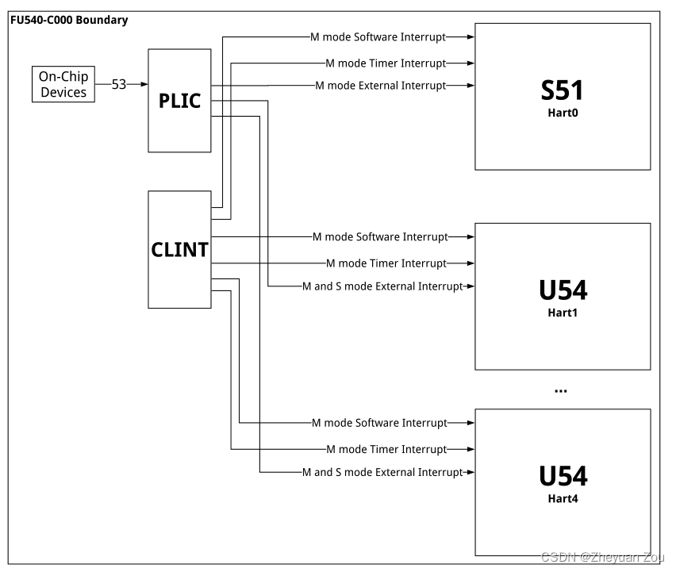
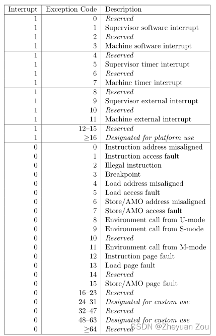
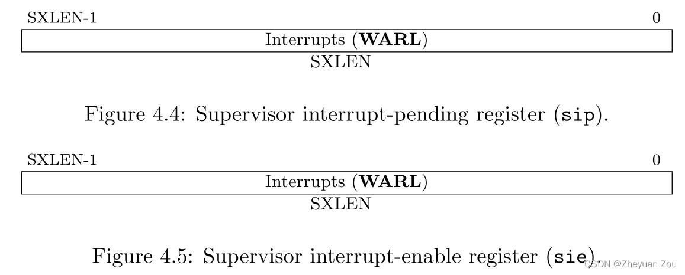

Before RISC-V AIA ... 

# 1 RISC-V 异常与中断

## 1.1 基本概念与分类

在RISC-V标准中，将**异常(exception)**定义为当前CPU运行时遇到的与指令有关的不寻常情况，而使用**中断(interrupt)**定义为因为外部异步信号而引起的让控制流脱离当前CPU的事件。而**陷阱(trap)**表示的则是，由异常或者中断引起的控制权转移到陷阱处理程序的过程。

中断也可以进一步细分为两种情况，一种是本地中断，一种是全局中断。本地中断包括软件中断和定时器中断，它们由CLINT (Core-Local Interruptor, 核心本地中断器) 来控制；另一种是外部设备引起的中断，也被称为全局中断，它们由PLIC (Platform-Level Interrupt Controller,平台级中断控制器) 来控制。PLIC、CLINT和RISC-V Core的连接逻辑示意图如下：



而无论是异常还是中断，它们所导致的**硬件陷阱流程**都是一样的，具体来说有两个大动作：

>1. 改变控制流
>
>   将PC的值保存在sepc中，然后将stvec中保存的陷阱处理函数地址放入PC。
>
>2. 更新CSRs的值
>
>   包括：`sstatus/stval/scause`

当我们说一个 **X-Mode 的异常**时 (X可以是U/S/M任何一种模式)，我们指的本质上是当异常发生时 CPU 正工作在 X-Mode。而 **X-Mode 的中断**我们指的是，PLIC触发了一个必须由 X-Mode 响应的中断，CPU并不一定需要正在工作在此模式下。

时钟中断作为一种特例，在RISC-V处理器中被硬连线为一个M-Mode的中断，这也就是说它必须由M模式下的 interrupt handler 响应，当然这是后话，我们会在后面重提。

## 1.2 陷阱的委派

事实上，在RISC-V的标准定义中，所有陷阱默认都是由机器模式(M-mode)来处理的。然而，在支持操作系统的设备上往往都实现了监管者模式 (S-Mode)，如果按照默认模式发生中断则应该首先陷入 M-Mode 下的中断处理程序，然后触发一个S-Mode 下的中断再 mret 回 S-Mode 下处理，这个过程过于繁琐且需要程序员自己实现，所以：

RISC-V标准为了应对这种情况提出了陷阱委派机制。也就是说在M-Mode下可以配置寄存器，从而使得S-Mode下的所有陷阱都被S-Mode下的陷阱处理函数自动接管。有两个寄存器，`medeleg/mideleg`，分别用来**管理异常和中断的委派。**

首先是 `medeleg` 寄存器，它的示意图如下所示，当要把特定的异常委托给S-Mode时，只需要将 `mcause` 寄存器中对应数值位置的比特位置 1 即可，参考下面的表格。比如当把系统调用委托给S-Mode时，因为它对应的Exception Code是 8，那么只需要将此寄存器中第 8 位置为 1 即可。



注意，M-Mode下发生异常，即使它被托管到S-Mode，这个异常也不会被移交给S-Mode去处理，而是在M-Mode完成处理。这也就是RISC-V规范中所说的：Traps never transition from a more-privileged mode to a less-privileged mode(陷阱从不会从高优先级移交到低优先级)但是如果是发生在S-Mode下的异常，就会被S-Mode直接接管，不会再上交到M-Mode了，这被称为：traps may be taken horizontally(中断可以被水平接管)。

但是，如果一个属于S-Mode的中断从M-Mode委托给S-Mode（比方我们后面要看到的外部中断），这个中断在M-Mode下就会被屏蔽掉，一定要等到进入S-Mode时才会被处理。负责管理中断委派的是 `mideleg` 寄存器。

>这里有一些点值得澄清：在实现时，无论是在 qemu 还是在真正的 Verilog 实现中，所谓 `mideleg` 寄存器中M态下的本地中断（包括时钟中断和软中断）都是被硬连线直接连接到0的，所以委派时赋值全赋值为1只是出于方便，并不能真的把M-Mode下的本地中断交给S-Mode处理。**唯一可以被委派到 S-Mode 的中断是外部中断 MEI，**外部中断一旦被委派到 S-Mode，PLIC 就只会触发 S-Mode 下的中断挂起位 sip.SEIP了，我们在后面会看到更多细节。（注意，这里 M-Mode 下的本地中断在实现时不能实现委派是 SiFive_Unleashed 这块RISC-V平台的实现特例，具体情况要具体分析，也许以后电路设计不同了，结论就会有所改变，但在这里是成立的）。

所以其实时钟中断和软中断默认情况下都是M-Mode中断，这是由硬件实现决定的，可能你会问那么 `STI/SSI` 还有什么意义呢，反正它们也不会被触发。事实上，**它们被触发的唯一可能场景就是在M-Mode下的中断处理程序中被置位，然后通过mret回到S-Mode下再处理**。

## 1.3 CSRs

### sstatus

`sstatus` 寄存器的全称是 supervisor status register，顾名思义，它是用来反映S-Mode下处理器的工作状态的。当执行RV64时，`sstatus` 寄存器的示意图如下所示：


在 `sstatus` 中与异常和中断有关的位有 `SPP/SIE/SPIE`，下面一个一个来看。

* ***SPP***

  SPP记录的是在进入S-Mode之前处理器的特权级别，为0表示陷阱源自用户模式(U-Mode)，为1表示其他模式。当执行一个陷阱时，SPP会由硬件自动根据当前处理器所处的状态自动设置为0或者1。当执行SRET指令从陷阱中返回时，如果SPP位为0，那么处理器将会返回U-Mode，为1则会返回S-Mode，最后无论如何，SPP都被设置为0。

* ***SIE***

  SIE位是S-Mode下中断的总开关，就像是一个总电闸。如果SIE位置为0，那么无论在S-Mode下发生什么中断，处理器都不会响应。但是如果当前处理器运行在U-Mode，那么这一位不论是0还是1，S-Mode下的中断都是默认打开的。也就是说在任何时候S-Mode都有权因为自己的中断而抢占位于U-Mode下的处理器，这一点要格外注意。想想定时器中断而导致的CPU调度，事实上这种设计是非常合理的。

  > **所以SIE位是S-Mode下的总开关，而不是任何情况下的总开关，真正完全负责禁用或者启用特定中断的位，都在 sie 寄存器中**，下面再详细解释。

* ***SPIE***

  SPIE位记录的是在进入S-Mode之前S-Mode中断是否开启。当进入陷阱时，硬件会自动将SIE位放置到SPIE位上，相当于起到了记录原先SIE值的作用，并最后将SIE置为0，表明硬件不希望在处理一个陷阱的同时被其他中断所打扰，也就是从硬件的实现逻辑上来说不支持嵌套中断(即便如此，我们还是可以手动打开SIE位以支持嵌套中断)。当使用SRET指令从S-Mode返回时，SPIE的值会重新放置到SIE位上来恢复原先的值，并且将SPIE的值置为1。

关于RISC-V中位于不同特权模式下的响应问题，标准中有进一步的说明：

当一个处理器在特权模式 `x(x = U/S/M)` 运行时，xIE 控制着对应模式下的中断总开关。**对于更低优先级的中断来说，是默认全部禁用的，而对于更高优先级的中断来说是默认全部打开的。**这意味着在任何时候高优先级都拥有着对处理器的抢占权，而低优先级则被强行剥夺打断高优先级的权力。

那么用户难道对这种机制无能为力，只能任凭高优先级随意打断低优先级模式吗？其实也不是，标准上说可以通过禁用某种特定的中断，使得对应的中断发生时，低优先级的运行不受影响，这是通过设置 `mie/sie` 寄存器实现的。(Higher-privilege-level code can use separate per-interrupt enable bits to disable selected higher-privilege-mode interrupts before ceding control to a lower-privilege mode.)

另外，RISC-V在硬件层面上来说不支持陷阱的嵌套，硬件只假设最理想的情况，即：**发生陷阱->处理它(在此期间完全不发生其他陷阱)->恢复到原先状态。**

### stvec

`stvec` 寄存器的全称是 supervisor trap vector base address register(S态陷阱向量基址寄存器，stvec)，它的示意图如下：


可以看到stvec寄存器分为两个域，分别是BASE域和MODE域：

* ***MODE 域***

  在RISC-V标准的定义中，MODE域可能的取值有如下三种：、

  

  可以看到，MODE 域的取值影响了发生陷阱时要跳转到的地址。之前我们为了描述的方便，一般简单地说 `stvec` 中存放着中断处理程序的地址，发生陷阱时会直接跳转到。但其实 `stvec` 寄存器中不仅仅是中断处理程序的地址，还存放着 MODE 域的值。

  > * 当BASE域为0时，所有的陷阱全部跳转到BASE地址指向的程序入口；
  > * 当BASE域为1时，同步陷阱 (指因为指令而引起的异常) 还是会跳转到BASE地址处，而非同步陷阱 (指由外部信号引起的中断) 则会跳转到 `BASE + 4*cause` 的地方，这里手册上举了一个例子：如果我们将MODE设置为Vectored 状态，同时触发了一个 S-Mode 定时器中断 (中断号为5)，则程序会跳转到 `BASE + 4*5 = BASE + 0x14` 的位置。

* ***BASE 域***

  BASE域存放着一个基地址，在 Direct/Vectored 模式下的同步陷阱情况下，它都指向中断处理程序的地址 (这里的地址可以是虚拟地址，也可以是物理地址)。

  在Vectored模式的非同步陷阱的情况下，比如由外部中断引起的陷阱时，它是中断服务程序的基址，加上一个特定偏移量之后才可以对应到对应的中断处理程序。

  另外，BASE域有额外的限制因素，它必须是 4 字节对齐的 (4-byte aligned)。内核实现时，代码中需要添加：

  ```c
  .align 4
  ```

  这是为了让代码文件按照4字节对齐，从而满足了 `stvec` 寄存器的写入需求。

### sip/sie

`sip/sie` 这两个寄存器与中断的处理密切相关，在手册对应的部分不仅有关于这两个寄存器的说明。而且还有大量有关中断机制的细节描述，接下来的各个小段都是从RISC-V标准中阅读得到的总结，在此做一个详细记录。

`sip/sie` 都是处理器与中断有关的寄存器，它们合称 (Supervisor Interrupt Registers，S-Mode 中断寄存器)，`sip` 专门用来记载挂起的中断位，`sie` 专门用来记载使能的中断位，它们的示意图如下：



在RV-64标准中，这两个寄存器都是64位大小的。 标准中断只占据了这两个寄存器的低16位(15:0)，更高的位都被保存下来以作为扩展用途。和 `medeleg/mideleg` 寄存器的用法差不多，**将中断号对应的位在这两个寄存器中置位**即可，如下图所示：


如果我们想**触发一个 S-Mode 下的软件中断，因为它的异常编号是1，则只需要在sip中将第 1 位设置为 1 即可，**`sie` 寄存器的使用方法也是一样的，它表示的是对应编号的中断是否使能。

#### 中断被呈递到何种特权级下处理？

这是一个非常重要的话题，在RISC-V处理器中的三种特权模式来回切换让人眼花缭乱，而它们又与对应模式下的中断紧密联系在一起，再加上我们上面说的陷阱委托机制，让整个RISC-V架构的陷阱与特权模式对应关系非常混乱。幸好，RISC-V标准中明确说明了中断应该被放在哪种特权模式下处理的对应原则：

* **当下述条件全部满足时，中断一定要在M-Mode下处理：**
  * 当前特权级别a为 M-Mode 且 mstatus中的 MIE 打开，或当前特权级别低于 M-Mode<font color='red'>（中断总开关打开）</font>
  * `mip/mie` 中的第 i 位都被设置为 1 <font color='red'>(表明中断待处理且使能位打开) </font>
  * `mideleg` 寄存器存在，且第 i 位没有被设置 <font color='red'>（中断没有委托给S Mode）</font>

所以，如果内核使用了陷阱委托机制，这里彻底将外部中断的第三个条件破坏了。

* **当下述条件同时满足时，中断一定要在S-Mode下处理：**
  * 当前特权级别为S-Mode且sstatus中的SIE打开，或当前特权级别低于S-Mode <font color='red'>(中断总开关打开)</font>
  * `sip/sie` 中的第 i 位都被设置为 1 <font color='red'>(表明中断待处理且使能位打开)</font>

#### 响应中断的时机

在RISC-V标准中有关sip和sie寄存器的介绍中，手册中有这样一段话：

> These conditions for an interrupt trap to occur must be evaluated in a bounded amount of time
> from when an interrupt becomes, or ceases to be, pending in sip, and must also be evaluated
> immediately following the execution of an SRET instruction or an explicit write to a CSR on which
> these interrupt trap conditions expressly depend (including sip, sie and sstatus).

译：这些中断陷阱发生的条件(指上述5.1节中的条件)，必须在一个中断在sip中被置位或清除后的一段时间内得到检测。 并且在紧跟着SRET指令之后，或对CSR寄存器中与中断陷阱条件有关的寄存器(包括sie、sip、sstatus)进行**显式写入之后立即检测。**

这就是标准中有关**中断检测时机**的描述，具体的实现可能和芯片的微体系结构有关，但现在我们可以假定在上述动作完成之后，就会进入中断的条件检测，而一旦条件满足就开始响应中断。

#### 外部中断、claim/complete机制

`sip` 寄存器中的每一位在实现时，可以是可读可写的，也可以是只读的，也就是说这里RISC-V标准并没有对 `sip` 寄存器的读写性加以严格的约束。但是后面标准中提到，如果 `sip` 寄存器中的位可写，那么清除某个特定中断的操作就是向它的对应位写入 0 即可。但如果 `sip` 寄存器是只读的，那么必须提供其他机制来实现对 `sip` 对应位的清零，具体怎么实现则要看微处理器的具体构成和实现。**注意，这里所说的只读 (read-only) 只是说，我们不能用指令的形式去有效地清除对应的pending bit，但绝非没有硬件电路能去改变它，**我们下面就会看到是怎么做的了。

对应的，`sie` 作为 `sip` 对应的使能位，如果一个中断可以被挂起，那么它对应的 `sie` 位一定是可写的。但如果对应的位在 `sip` 中没有对应，那么 `sie` 对应的位就不能写入，而是只读的 0 (read-only zero)。

上述寄存器中负责控制外部中断的位有 `sip.SEIP/sie.SEIE` 这两个位，在一般的处理器中 `sip.SEIP` 就会被实现为只读的 (read-only)，它的清除与置位操作一般会直接交给特定平台的中断控制器来做。在 SiFive Unleashed 开发板上，处理外部中断的就是 PLIC 这个负责管理全局外部中断的 IP 核。CPU核心只需要对 `sip.SEIP` 进行读取即可知道是否有外部中断挂起。

这里我们直接顺势对 PLIC 和中断处理流程做出延伸，打开 SiFive 的开发板手册，找到关于 Interrupts 一章的概述。我们可以看到这一章的开头就对开发板的 PLIC 做出了描述：

> Global interrupts, by contrast, are routed through a Platform-Level Interrupt Controller (PLIC),
> which can direct interrupts to any hart in the system via the external interrupt. Decoupling global
> interrupts from the hart(s) allows the design of the PLIC to be tailored to the platform, permitting
> a broad range of attributes like the number of interrupts and the prioritization and routing
> schemes.

(译：相比之下，全局中断通过平台级中断控制器(PLIC)进行路由，PLIC可以通过外部中断将中断引导到系统中的任何hart。将全局中断与hart解耦，可以根据平台定制PLIC的设计，允许广泛的属性，如中断数量、优先级和路由方案)。

所以其实 PLIC 这样的中断控制器的引入是为了更加灵活地对外部中断进行管理，使得开发板有更好的适应性与可裁剪性。就像本科时我们学过的微机原理，8059A也就是8086的中断控制器一样，可以对外部中断进行更好的管理，在我们的SiFive 开发板上一共支持53个13大类外部设备中断，它们预留的ID范围如下图所示。这么多的中断其实都属于外部中断，但是它们在RISC-V的CPU中其实只有一个 `sip.SEIP/sie.SEIE` 两个位对应。所以，我们也不得不用一个强大的PLIC核心去细化和丰富对外部设备中断的管理过程。


在更加深入地对中断进行介绍之前，我们还要对PLIC的 **claim/completion 机制**进行解释。让我们回顾一下PLIC与RISC-V核心之间的连接关系，一个PLIC本质上连接了多个RISC-V核心。当一个外部设备发出中断请求时，经过PLIC中的Interrupt Gateways的信号转换等操作，其实PLIC会将这个中断转发给多个核心(前提是对应核心中 `sie` 寄存器中对应位是打开的)，这个操作叫做 interrupt notification，本质是PLIC将对应核心 `sip` 寄存器中的对应位置位。

这个 notification 操作在简单系统的硬件实现中，是通过将PLIC核心中的 PIE 位硬连线到对应的 `sip.SEIP` 寄存器位来实现的，而在复杂的系统中是通过复杂的片上路由网络实现的。在外部中断全部被委派到S-Mode的条件下，它只会导致多个核心中的 `sip.SEIP` 位置位 (The notification only appear in lower-privilege xip registers if external interrupts have been delegated to the lower-privilege modes, quoted from PLIC doc)。根据我们之前总结的触发中断的条件，多个核心或早或晚会这个对挂起的中断进行响应。那么，多个核心之间其实就已经有了对中断响应的竞争。


一个核心如何对 interrupt notification 进行响应呢？这个操作我们叫做 claim 操作，本质就是一个简单的对claim/complete 寄存器的读操作，claim/complete 寄存器会保存一个当前未被处理且具有最高优先级的中断的 ID 号。CPU读取 claim/complete 寄存器就可以获得这个 ID 号，同时也就完成了对此中断的 claim 操作，回到内核中就可以匹配对应的中断处理程序 (interrupt handler) 进行对应的处理。在 `drivers/irqchip/irq-sifive-plic.c` 中：

```c
/*
 * Handling an interrupt is a two-step process: first you claim the interrupt
 * by reading the claim register, then you complete the interrupt by writing
 * that source ID back to the same claim register.  This automatically enables
 * and disables the interrupt, so there's nothing else to do.
 */
static void plic_handle_irq(struct irq_desc *desc)
{
	//...
	while ((hwirq = readl(claim))) {
		int err = generic_handle_domain_irq(handler->priv->irqdomain,
						    hwirq);
		if (unlikely(err))
			pr_warn_ratelimited("can't find mapping for hwirq %lu\n",
					hwirq);
	}
	//...
}
```

当一个中断的 notification 被 claim 后 (也就是 `claim/complete` 寄存器被读取后)，PLIC 核心会自动清除掉对应中断源在PLIC 中的挂起位 (clear down the corresponding source’s IP bit)，表示这个中断已经被处理了。

当一个高优先级的中断被处理之后，低优先级中断可能又会补上，所以PLIC中的PIE位可能还是不会被清零，这也就导致了多个核心中的 `sip.SEIP` 位其实还是没有被清 0 。也就是说，在一个多核平台上，可能同时发生的，需要被处理的中断不止一个。这时，它们可能会被其他核心响应。即使是在一个核心内部，PLIC标准上也建议，在 interrupt handler 返回前可以查看一下核心自己的 `sip.SEIP` 位是否还为1，如果还是1，就可以跳过恢复现场的步骤，直接 claim 下一个中断并服务吧，节省时间 ！

最后，如果一个核心 claim 时已经没有中断要处理了 (有可能是没有竞争过其他核心，也有可能是确实没有中断要处理)，读取PLIC中的 `claim/complete` 寄存器就会返回0，进而回到 OS 内核后什么也不做，这在上面的代码中也有对应。实际上，中断ID为 0 在标准中对应的含义就是：“无需响应的中断”。

现在一个核心 claim 了一个中断并将其服务完毕，它就会进行一个 complete 操作，这个操作和 claim 操作很像，只是完全相反——它是向 `claim/complete` 寄存器写入它刚刚完成服务的中断ID号，这个ID号会被转发给 Gateways，进而Gateways 会再次开始对对应ID号的中断进行转发。在没有完成 complete 操作之前，Gateways 是不会转发同样ID号的中断给PLIC核心的，所以在完成complete操作之前这种中断也就不会被处理。

><font color='red'>**最后梳理一下这个过程：**</font>
>
>1. 外部设备发起一个中断给PLIC中的Gateways，Gateways负责将中断信号进行转换并转发给PLIC核心，这个过程中会涉及Priority、Threshold等等一系列的判断 (详见上面的电路)，最终会体现在PLIC核心的 EIP 位上；
>2. EIP 位一旦被置 1，会直接导致多个核心上的 `sip.SEIP` 位被置 1。进而导致多个打开此中断的CPU核心开始竞争claim 这个中断，没有竞争过其他核心时会得到中断ID为 0，进而不响应，这个过程叫做 claim 操作；
>3. 响应最早的核心成功开始服务这个中断，并在服务完成之后将中断ID号再次写入 `claim/completion` 寄存器，这个过程叫做 complete 操作；
>4. 这个 complete 操作会被转发到 Gateways，进而再次开启对这种中断的转发。

#### 软中断和定时器中断

注意力再次回到 `sip/sie` 寄存器中，除了 `sip.SEIP` 只读位用来反映外部中断以外，还有 `sip.SSIP/sip.STIP` 位来分别反映软中断和时钟中断。在开发板的手册中，这两者都属于本地中断，都交由 **CLINT(核心本地中断器)** 来管理。


> ***时钟中断***

`sip.STIP/sie.STIE` 位分别用来管理时钟中断的挂起和使能，时钟中断在内核中主要是用来做CPU调度的。也就是我们常说的时间片轮转调度算法 (Round-Robin, RR)，一个进程经过一段时间之后会自动让出CPU的使用权，让其他进程进行执行。

`sip.STIP` 位也非常特殊，和 `sip.SEIP` 一样，一旦被实现就只能是只读的 (read-only)，只能被执行环境 (execution environment) 所设置和清除。这里所谓的执行环境指的就是操作系统里的中断服务程序。

之前，我们就简单提过**时钟中断是被 CLINT 硬连线为一个 M-Mode 中断的，**并且这个中断不能被委派到 S-Mode，所以时钟中断怎么也轮不到内核去处理，它真的得由硬件机制去触发。这里就非常巧妙了，目前简单给出一个结论：**内核中 M-Mode 下的时钟中断的 interrupt handler 会使用汇编代码主动触发一个 S-Mode 下的软中断，从而将时钟中断的处理权移交给位于 S-Mode 下的操作系统，操作系统处理完时钟中断之后会将这个软中断清除以表明完成了对时钟中断的处理。**所以，其实内核借用了 S-Mode 下的软中断去完成对时钟中断的响应，这是因为操作系统往往要借助时钟中断来完成一些功能，而这些功能属于 S-Mode 下的操作系统的一些概念 (比如CPU调度、sigalarm等)，所以其实将原本位于 M-Mode 下的时钟中断移交给 S-Mode 非常自然。

> ***软中断***

软中断则与 `sip.SSIP/sie.SSIE` 有关，与前两者不同，它既可以由指令读写，也可以由 CLINT 来控制。**软件中断是通过指令来触发的，具体是写入 CLINT 中的 msip 寄存器。**这个寄存器有 32 位，高 31 位全部被硬连线到 0，最低位则直接映射到 `mip.MSIP` 位。软件中断在硬件实现中，根据示意图分析，应该也是像时钟中断一样，被强制硬连线到M-Mode下。软中断一般用于多个处理器核心之间的通信，各个核心都可以通过指令触发另外核心的软件中断。

至此，我们将 `sip/sie` 寄存器讲解的差不多了，并顺带介绍了大量有关外部中断、时钟中断和软件中断的处理流程和细节。在实际实现RISC-V核心时，并不一定要实现上述的所有中断类型，当某种中断类型没有被实现时，它对应的 `sip/sie` 寄存器的对应域会被硬连线到 0 。

最后，当这三种中断同时发生时，它们的相对优先级是 `SEI > STI > SSI`。

### sscratch

`sscratch` 寄存器的设计是RISC-V中一个非常巧妙的机制，这个寄存器中存放着一个 (虚拟) 地址。当在执行用户代码时，这个地址指向的是一块保存当前程序上下文 (其实就是寄存器组内容，context) 的一块内存区域，可以将其称做陷阱帧`trapframe`。

当CPU处理陷阱的时候，PC会被设置为 `stvec` 寄存器的值，进而陷入一段过渡程序，在这段程序的开头就会将 `sscratch`寄存器和 `a0` 寄存器进行交换，这一方面将 `a0` 的值保存在了 `sscratch` 寄存器中，同时 `a0` 指向了 `trapframe` 的开始地址，这样进而就可以通过 `a0` 寄存器寻址将所有寄存器的值保存在 `trapframe` 里，妙绝！

### sepc

`sepc` 寄存器，一言以蔽之就是记录陷阱陷入到 S-Mode 时发生陷阱的指令的虚拟地址，它在执行陷阱时会记录下被中断的指令的虚拟地址，除了刚才说的陷阱场景之外，硬件不会主动改变 sepc 的值。但是 spec 寄存器可以被指令写入，如果执行系统调用的话，内核会将返回地址 +4 并赋给 `sepc`，这表明系统调用会返回 ecall 的下一条指令继续执行。

### scause


`scause` 寄存器在执行陷阱时由硬件自动记录下导致本次陷阱的原因，其中 interrupt 位表示本次陷阱的原因是否为中断(我们上面说过，陷阱是动作，而中断和异常是导致陷阱的原因)。而 Exception Code 则表示细分的原因，对应关系如下表，可以看到scause还是有很多可扩展的异常号没有被使用的：


在内核的具体实现中，我们会根据 `scause` 中记录的异常号实现对陷阱“分门别类”的处理。和 `sepc` 一样，`scause` 也支持使用指令写入，但是一般不这么做。

### stval

`stval` 寄存器的全称是 Supervisor Trap Value Register，这个寄存器专门用来存放与陷阱有关的其他信息，目的是帮助操作系统或其他软件更快确定和完成陷阱的处理。手册上相关的叙述显得有些晦涩，这里简单地做一个总结：

首先，`stval` 寄存器中存储的值可以是零值或者是非零值，对于大部分未经硬件平台定义的陷阱情况而言，`stval` 并不会存储与这些陷阱有关的信息，这时候 `stval` 就会存储零，本质上 `stval` 没有存储什么有效信息。**存储非零值的情况又分为两种，一种是因为内存访问非法，一种则是因为指令本身非法，**下面详细说说：

> * 内存访问非法
>
>   这种情况包括硬件断点 (Hardware Breakpoints)、地址未对齐 (address misaligned)、访问故障 (access-fault，可能是没有权限等)、缺页故障 (page-fault) 等情况。当这种情况发生时，`stval` 会存储出错位置的虚拟地址。比如缺页故障发生时，`stval` 就会记录到底是对哪个虚拟地址的访问导致了本次缺页故障，内核就可以根据此信息去加载页面进入内存。
>
> * 指令执行非法 
>
>   当执行的指令非法时，`stval` 会将这条指令的一部分位记录下来。illegal instruction, 异常号为 2。

# 2 CLINT/PLIC

[riscv/riscv-plic-spec: PLIC Specification (github.com)](https://github.com/riscv/riscv-plic-spec)