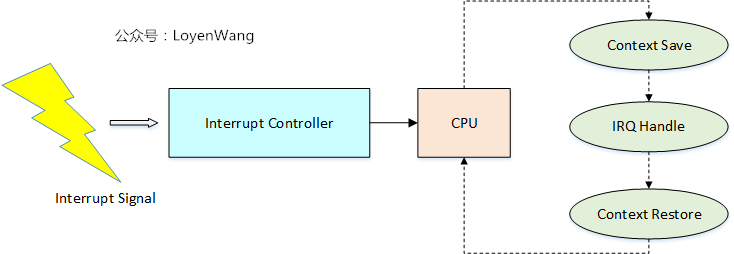
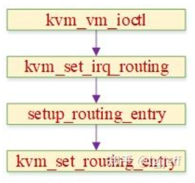
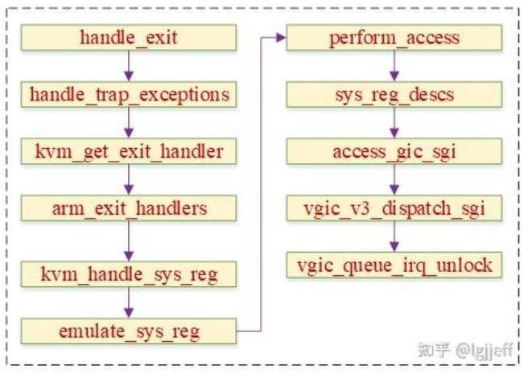

> 本文基于以下软硬件假定：
>
> 架构：AARCH64
>
> 内核版本：5.14.0-rc5
>
> 中断控制器：GICv3

# 1 ARMv8中断

## 1.1 中断基本流程

### 基本概念

在讲述**中断虚拟化**之前，我们应该对中断的作用与处理流程有个大致的了解：



- 中断是处理器用于异步处理外围设备请求的一种机制；
- 外设通过硬件管脚连接在中断控制器上，并通过电信号向中断控制器发送请求；
- 中断控制器将外设的中断请求路由到CPU上；
- CPU（以ARM为例）进行模式切换（切换到IRQ/FIQ），保存Context后，根据外设的中断号去查找系统中已经注册好的Handler进行处理，处理完成后再将Context进行恢复，接着之前打断的执行流继续move on；
- 中断的作用不局限于外设的处理，系统的调度，SMP核间交互等，都离不开中断；

**中断虚拟化，将从中断信号产生到路由到vCPU的角度**来展开，包含以下三种情况：

>1. 物理设备产生中断信号，路由到 vCPU（中断直通）；
>2. 虚拟外设产生中断信号，路由到 vCPU；
>3. Guest OS中CPU之间产生中断信号（IPI中断）；

### GICv3中断处理

由于soc中外设及与其相关的中断数量众多，且各中断又有不同的配置方式，为了减轻cpu的负担，现代处理器中断的配置和管理一般都通过中断控制器实现。GICv3是armv8架构比较常用的中断控制器，它通常以如下方式与cpu相连：


外设将中断信号线连接到GICv3，cpu可通过GICv3的寄存器设置中断的触发方式、优先级以及路由方式等属性。当中断被触发后，则通过cpu与gic之间的中断信号线IRQ或FIQ通知cpu。此后，cpu通过中断向量表进入中断处理函数，在中断处理完成后通过gic的EOI寄存器通知其中断已处理完毕。

在上图中除了IRQ和FIQ之外，cpu和gic之间还有两条中断信号线vIRQ和vFIQ。它们是GICv3为支持虚拟化而扩展的，目的是用于向vcpu发送中断信号，其具体原理将在下一章中介绍。

## 1.2 GICv3

为了实现中断的配置、接收、仲裁和路由功能，GICv3设计了下图所示的组件，它包含了**SPI、PPI、SGI和LPI**四种中断类型，以及**distributor、redistributor、ITS和cpu interface**四大组件，它们的关系如下：


`distributor` 主要包含两部分功能：

* 作为编程接口可以通过GICD寄存器，对中断控制器的一些全局属性以及SPI类型中断的属性进行配置
* 中断触发时根据寄存器设定的中断分组、优先级以及亲和性等配置，将SPI和SGI中断路由到特定的redistributor和cpu interface上

`redistributor` 位于 distributor 和 cpu interface 之间，它也包含如下两部分功能：

* 作为编程接口可以通过GICR寄存器，对PPI和SGI类型中断的属性进行配置，以设定其中断触发类型、中断使能以及中断优先级等。同时，其还包含了电源管理、LPI中断管理功能
* 将最高优先级的pending中断发送到与其对应的cpu interface上

`cpu interface` 可用于物理中断、虚拟中断处理，以及可为hypervisor提供虚拟机控制接口。其包括SGI中断产生、PPI、SGI的优先级设置，最高pending优先级读取以及应答、deactivate、完成操作执行等。

`ITS` 是gicv3的高级功能，其作用是将一个来自device的输入eventID转换为LPI中断号，并确定该中断将被发送的目的PE。由于它与中断主体流程并无相关性，因此本文将不涉及到 ITS 相关的内容。

## 1.3 补充: ARMv8虚拟化架构

在讲中断虚拟化之前，有必要先讲一下ARMv8中Hypervisor的架构，因为涉及到不同的Exception Level的切换


- `Non-VHE`
  * Linux ARM架构的Hypervisor在引入时，采用的是左图中的系统架构，以便能充分利用Linux现有的机制，比如scheduler等；
  * KVM/ARM的实现采用了`split`模式，分成`Highvisor`和`Lowvisor`，这样可以充分利用ARM处理器不同模式的好处，比如，`Highvisor`可以利用Linux Kernel的现有机制，而`Lowvisor`又可以利用`Hyp Mode`的特权。此外，带来的好处还包含了不需要大量修改Linux内核的代码，这个在刚引入的时候是更容易被社区所接受的；
  * `Lowvisor`有三个关键功能：
    * 对不同的执行Guest Context进行隔离与保护，比如VM之间不会相互影响；
    * 提供Guest和Host的相互切换，也就是所谓的 `world switch`;
    * 提供一个虚拟化`trap handler`，用于处理trap到Hypervisor的中断和异常；

- `VHE`
  * `VHE: Virtualization Host Extensions`，用于支持Host OS运行在EL2上，Hypervisor和Host OS都运行在EL2，可以减少Context切换带来的开销；
  * 目前`Cortex-A55, Cortex-A75, Cortex-A76`支持VHE，其中VHE的控制是通过`HCR_EL2`寄存器的操作来实现的；

>再补充一个知识点：
>
>1. Host如果运行在EL1时，可以通过`HVC（Hypervisor Call）`指令，主动trap到EL2中，从而由Hypervisor来接管；
>2. Guest OS可以配置成当有中断或异常时trap到EL2中，在中断或异常产生时，trap到EL2中，从而由Hypervisor来接管；
>3. EL2可以通过`eret`指令，退回到EL1；

# 2 虚拟中断原理

虚拟中断的实现需要 `cpu/gic` 共同配合，首先GICv3提供了一组名为 list register（LR）的寄存器，host 可以通过将中断信息写入该寄存器来触发虚拟中断。其次，cpu 在原先 `irq/fiq` 两条中断线的基础上又增加了两条虚拟中断线 `virq/vfiq`，以用于虚拟中断的接收。

在虚拟中断被触发后，guest 需要通过 cpu interface 执行中断的应答、结束等操作。为了提高中断处理效率，GICv3又在硬件上支持了一组虚拟`cpu interface` 寄存器。使 guest 可以直接操作这些寄存器，从而避免了需要 host 模拟 cpu interface 设备。

由于物理设备的中断通常都需要由 host 处理，因此若 guest 的中断与物理中断关联，则应该先路由给 host 处理。armv8 可以通过 `hcr_el2` 寄存器配置该能力：

* 若未使能vhe，可通过设置hcr_el2.FMO和hcr_el2.IMO，以将EL1的guest中断路由到EL2
* 若使能了vhe，则可通过设置hcr_el2.TGE，将EL1的guest中断路由到EL2

Host 执行相应处理后，就可以通过设置 lr 寄存器，将其以虚拟中断的方式注入到给guest。下图为其总体框图：


上图红线部分是 **guest 中断从触发到处理**的全流程，我们再来模拟一遍：

1. 外设触发irq中断，gic的distributor接收到该中断后，通过distributor的仲裁器确定其应该被发送的cpu

2. 在target cpu确定以后，将中断发送给该cpu相关的redistributor

3. redistributor将中断发送到其对应的cpu interface上

4. 该中断被路由到EL2的hypervisor中断处理入口

5. hypervisor退出到host，然后重新使能中断，使中断再次触发，并由host中断处理函数执行中断处理

6. host通过写lr的方式向guest注入虚拟中断，并切入guest执行

7. 虚拟中断通过virq触发，并进入guest的中断入口函数

8. guest执行中断处理流程，并通过虚拟cpu interface执行中断应答以及EOI等操作

9. 若该虚拟中断与物理中断关联，则EOI操作将会作用到实际的物理中断上

10. 中断处理完成

除了硬件中断以外，host 还可以直接向 LR 中注入虚拟中断。这种方式一般被用于模拟设备触发的中断，以及 vcpu 之间发送的 ipi 中断。

接下来我们再看下 guest 操作 `distributor/redistributor` 时的流程，它们由上图右边紫线连接的模块构成。**由于GICv3并未为虚拟中断实现硬件 `distributor/redistributor` 模块，因此 host 需要为 guest 通过软件模拟这两个设备。当 guest 需要操作它们相关寄存器时，会通过IO异常返回 host，并由 host 执行对应寄存器的模拟工作。**

我们不妨思考一下，GICv3为什么为虚拟中断的 cpu interface 实现了硬件支持，而没有实现 `distributor/redistributor`。我个人理解主要由以下两点原因：

> * 虚拟中断是直接通过 cpu interface 注入到 guest 中的，因此在中断注入流程中并不需要 `distributor/redistributor` 的支持
> * 由于上面的原因，虚拟中断只使用 `distributor/redistributor` 的中断配置功能，而中断配置是低频操作，对性能的要求不高，因此能够接受软件模拟方式。但是若中断触发比较频繁，则中断应答等操作对性能要求就比较高，硬件支持cpu interface接口正好可以满足该要求

最后，GICv3还为 hypervisor 实现了一组虚拟中断管理寄存器，如 `ICH_VMCR_EL2`、`ICH_VTR_EL2` 等。这些寄存器可用于使能/禁用虚拟中断，获取虚拟中断的属性信息等。

# 3 kvm中vgic组件的实现

kvm的vgic设备可以在用户态或内核态实现，其原理是类似的，为了描述方便，接下来我们的介绍将围绕内核态实现方式展开。vgic架构主要包含**虚拟distributor、虚拟redistributor，以及list register寄存器**的功能实现。 

其中 `distributor/redistributor` 虚拟设备实现虽然位于内核中，但是像io基地址、中断数量之类的属性还是需要通过用户态配置的。因此需要为它们创建用户态操作接口，该流程是通过以下函数中匿名inode接口实现的：

```c
static int kvm_ioctl_create_device(struct kvm *kvm,
				   struct kvm_create_device *cd)
{
	//...
	type = array_index_nospec(cd->type, ARRAY_SIZE(kvm_device_ops_table));   
	ops = kvm_device_ops_table[type];                                       
	//...
	dev->ops = ops;                                                       
	dev->kvm = kvm;

	mutex_lock(&kvm->lock);
	ret = ops->create(dev, type);                                            
	if (ret < 0) {
		mutex_unlock(&kvm->lock);
		kfree(dev);
		return ret;
	}
	list_add(&dev->vm_node, &kvm->devices);                               
	mutex_unlock(&kvm->lock);

	if (ops->init)
		ops->init(dev);

	kvm_get_kvm(kvm);
	ret = anon_inode_getfd(ops->name, &kvm_device_fops, dev, O_RDWR | O_CLOEXEC); 
	//...
	return 0;
}
```

其主要流程为根据设备类型，获取 `kvm_device_ops_table[]` 中预定义的设备操作函数，然后为其创建一个设备结构体，并为该设备创建一个名为 `kvm-arm-vgic-v3` 的匿名 inode。

**而 `kvm_device_ops_table[]` 中的回调函数在以下 kvm 初始化流程中设置：**


其中 `vgic_create` 回调在上面的设备创建流程中被调用，`vgic_v3_set_attr` 等属性操作接口可通过匿名inode对应的fd调用。它可被用于设置虚拟 `distributor/redistributor` 的基地址，及其所支持的中断号数量等。

## 3.1 distributor模拟

`distributor` 的属性设置流程如下：

```c
static int vgic_set_common_attr(struct kvm_device *dev,
				struct kvm_device_attr *attr)
{
	//...
	switch (attr->group) {
	case KVM_DEV_ARM_VGIC_GRP_ADDR: { //1)                                   
		u64 __user *uaddr = (u64 __user *)(long)attr->addr;
		u64 addr;
		unsigned long type = (unsigned long)attr->attr;

		if (copy_from_user(&addr, uaddr, sizeof(addr)))
			return -EFAULT;

		r = kvm_vgic_addr(dev->kvm, type, &addr, true);
		return (r == -ENODEV) ? -ENXIO : r;
	}
	case KVM_DEV_ARM_VGIC_GRP_NR_IRQS: {  //2)
		u32 __user *uaddr = (u32 __user *)(long)attr->addr;
		u32 val;
		int ret = 0;

		if (get_user(val, uaddr))
			return -EFAULT;

		if (val < (VGIC_NR_PRIVATE_IRQS + 32) ||
		    val > VGIC_MAX_RESERVED ||
		    (val & 31))
			return -EINVAL;

		mutex_lock(&dev->kvm->lock);

		if (vgic_ready(dev->kvm) || dev->kvm->arch.vgic.nr_spis)
			ret = -EBUSY;
		else
			dev->kvm->arch.vgic.nr_spis =
				val - VGIC_NR_PRIVATE_IRQS;

		mutex_unlock(&dev->kvm->lock);

		return ret;
	}
	case KVM_DEV_ARM_VGIC_GRP_CTRL: {
		switch (attr->attr) {
		case KVM_DEV_ARM_VGIC_CTRL_INIT:   //3)
			mutex_lock(&dev->kvm->lock);
			r = vgic_init(dev->kvm);
			mutex_unlock(&dev->kvm->lock);
			return r;
		}
		break;
	}
	}

	return -ENXIO;
}
```

1. 设置 `distributor` 的基地址
2. 设置其支持的中断数量
3. 初始化 `distributor`

在 `distributor` 设备创建及属性设置完成后，还需要**将其抽象出的`io`设备和`io region`注册到总线上，用于 guest 实际访问该虚拟设备时执行设备模拟操作，它会在vcpu第一次运行时被调用，**以下为其代码流程：


其中该 region 的实际 io 模拟函数在上图 `vgic_v3_init_dist_iodev` 函数中设置，其代码如下：

```c
unsigned int vgic_v3_init_dist_iodev(struct vgic_io_device *dev)
{
	dev->regions = vgic_v3_dist_registers;               //1          
	dev->nr_regions = ARRAY_SIZE(vgic_v3_dist_registers);//2           

	kvm_iodevice_init(&dev->dev, &kvm_io_gic_ops);       //3        

	return SZ_64K;
}
```

1. 设置实际的region的io模拟函数

2. 设置region数量

3. 注册设备的io操作回调函数

而 `vgic_v3_dist_registers` 数组的定义如下（arch/arm64/kvm/vgic/vgic-mmio-v3.c）：

```c
static const struct vgic_register_region vgic_v3_dist_registers[] = {
	REGISTER_DESC_WITH_LENGTH_UACCESS(GICD_CTLR,
		vgic_mmio_read_v3_misc, vgic_mmio_write_v3_misc,
		NULL, vgic_mmio_uaccess_write_v3_misc,
		16, VGIC_ACCESS_32bit),
	REGISTER_DESC_WITH_LENGTH(GICD_STATUSR,
		vgic_mmio_read_rao, vgic_mmio_write_wi, 4,
		VGIC_ACCESS_32bit),
	REGISTER_DESC_WITH_BITS_PER_IRQ_SHARED(GICD_IGROUPR,
		vgic_mmio_read_group, vgic_mmio_write_group, NULL, NULL, 1,
		VGIC_ACCESS_32bit),
	REGISTER_DESC_WITH_BITS_PER_IRQ_SHARED(GICD_ISENABLER,
		vgic_mmio_read_enable, vgic_mmio_write_senable,
		NULL, vgic_uaccess_write_senable, 1,
		VGIC_ACCESS_32bit),
	REGISTER_DESC_WITH_BITS_PER_IRQ_SHARED(GICD_ICENABLER,
		vgic_mmio_read_enable, vgic_mmio_write_cenable,
	       NULL, vgic_uaccess_write_cenable, 1,
		VGIC_ACCESS_32bit),
	//...
}
```

以上注册完成后，guest 就可以执行 distributor 相关的操作了，如 guest 执行读写 `GICD_CTLR` 寄存器时，则最终将会分别调用`vgic_mmio_read_v3_misc()/vgic_mmio_write_v3_misc()` 函数，这两个函数会分别模拟该寄存器的行为，并向 guest 返回相应的寄存器操作结果。

## 3.2 redistributor模拟

redistributor 的属性设置流程与 distributor 类似，其主要用于设置 redistributor 的基地址，以下为其代码实现：

```c
int kvm_vgic_addr(struct kvm *kvm, unsigned long type, u64 *addr, bool write)
{
	//...
	switch (type) {
	//...
	case KVM_VGIC_V3_ADDR_TYPE_REDIST: {
		struct vgic_redist_region *rdreg;

		r = vgic_check_type(kvm, KVM_DEV_TYPE_ARM_VGIC_V3);
		if (r)
			break;
		if (write) {
			r = vgic_v3_set_redist_base(kvm, 0, *addr, 0);
			goto out;
		}
		rdreg = list_first_entry_or_null(&vgic->rd_regions,
						 struct vgic_redist_region, list);
		if (!rdreg)
			addr_ptr = &undef_value;
		else
			addr_ptr = &rdreg->base;
		break;
	}
	case KVM_VGIC_V3_ADDR_TYPE_REDIST_REGION:
	{
		struct vgic_redist_region *rdreg;
		u8 index;

		r = vgic_check_type(kvm, KVM_DEV_TYPE_ARM_VGIC_V3);
		if (r)
			break;

		index = *addr & KVM_VGIC_V3_RDIST_INDEX_MASK;

		if (write) {
			gpa_t base = *addr & KVM_VGIC_V3_RDIST_BASE_MASK;
			u32 count = (*addr & KVM_VGIC_V3_RDIST_COUNT_MASK)
					>> KVM_VGIC_V3_RDIST_COUNT_SHIFT;
			u8 flags = (*addr & KVM_VGIC_V3_RDIST_FLAGS_MASK)
					>> KVM_VGIC_V3_RDIST_FLAGS_SHIFT;

			if (!count || flags)
				r = -EINVAL;
			else
				r = vgic_v3_set_redist_base(kvm, index,
							    base, count);
			goto out;
		}

		rdreg = vgic_v3_rdist_region_from_index(kvm, index);
		if (!rdreg) {
			r = -ENOENT;
			goto out;
		}

		*addr = index;
		*addr |= rdreg->base;
		*addr |= (u64)rdreg->count << KVM_VGIC_V3_RDIST_COUNT_SHIFT;
		goto out;
	}
	default:
		r = -ENODEV;
	}
	//...
}
```

与distributor类似，在redistributor属性设置完成后，还需要将其抽象出的io设备和io region注册到总线上，该流程在每个vcpu创建时被调用，以下为其代码流程：


其中 `vgic_v3_rd_registers` 数组的定义如下（arch/arm64/kvm/vgic/vgic-mmio-v3.c）：

```c
static const struct vgic_register_region vgic_v3_rd_registers[] = {
	REGISTER_DESC_WITH_LENGTH(GICR_CTLR,
		vgic_mmio_read_v3r_ctlr, vgic_mmio_write_v3r_ctlr, 4,
		VGIC_ACCESS_32bit),
	REGISTER_DESC_WITH_LENGTH(GICR_STATUSR,
		vgic_mmio_read_raz, vgic_mmio_write_wi, 4,
		VGIC_ACCESS_32bit),
	REGISTER_DESC_WITH_LENGTH(GICR_IIDR,
		vgic_mmio_read_v3r_iidr, vgic_mmio_write_wi, 4,
		VGIC_ACCESS_32bit),
	REGISTER_DESC_WITH_LENGTH_UACCESS(GICR_TYPER,
		vgic_mmio_read_v3r_typer, vgic_mmio_write_wi,
		NULL, vgic_mmio_uaccess_write_wi, 8,
		VGIC_ACCESS_64bit | VGIC_ACCESS_32bit),
	REGISTER_DESC_WITH_LENGTH(GICR_WAKER,
		vgic_mmio_read_raz, vgic_mmio_write_wi, 4,
		VGIC_ACCESS_32bit),
	//...
}
```

以上注册完成后，guest就可以执行redistributor相关的操作了，该操作最终会通过异常的方式被host捕捉到，并最终调用以上回调函数进行设备模拟操作。

## 3.3 list register

`list register` 的初始化流程比较简单，只要将这些寄存器初始化为 0 即可，以下为其初始化流程：


其中 `__vgic_v3_init_lrs` 的实现如下：

```c
void __vgic_v3_init_lrs(void)
{
	int max_lr_idx = vtr_to_max_lr_idx(read_gicreg(ICH_VTR_EL2));  //1
	int i;

	for (i = 0; i <= max_lr_idx; i++)
		__gic_v3_set_lr(0, i);                                 	   //2
}
```

获取lr寄存器的数量，遍历所有的lr寄存器，并将其初值设置为0。

# 4 虚拟中断注入流程

由于 `spi/ppi` 中断的注入流程是完全一样的，因此我们将把它们放在一起讨论。在此基础上 kvm 包含以下三种虚拟中断注入形式：

* **与实际硬件中断绑定的虚拟中断**
* **由模拟设备产生的中断**
* **vcpu 之间发送的ipi中断**

为了管理这些虚拟中断，每个 vcpu 结构体中都包含一个 ap_list 链表。该链表表示已经被注入到特定 vcpu 中，但尚未写到 list register 中的虚拟中断，其中 ap 表示 `active/pending`。

## 4.1 硬件中断注入

当使能了TGE之后，虚拟中断对应的硬件中断触发后会被路由到EL2的hypervisor，并由其中断入口函数处理，该函数定义如下：

```c
// arch/arm64/kvm/hyp/hyp-entry.S

el1_irq:
el1_fiq:
	get_vcpu_ptr	x1, x0
	mov	x0, #ARM_EXCEPTION_IRQ
	b	__guest_exit
```

其中 `__guest_exit` 会将系统从hypervisor切换为host状态，并返回到vcpu运行主流程 `kvm_arch_vcpu_ioctl_run` 中。该函数中会通过`handle_exit` 处理guest的退出条件，其代码实现如下：

```c
int handle_exit(struct kvm_vcpu *vcpu, int exception_index)
{
	struct kvm_run *run = vcpu->run;
	exception_index = ARM_EXCEPTION_CODE(exception_index);

	switch (exception_index) {
	case ARM_EXCEPTION_IRQ:
		return 1;
	case ARM_EXCEPTION_EL1_SERROR:
		return 1;
	case ARM_EXCEPTION_TRAP:
		return handle_trap_exceptions(vcpu);
		//...
		return 0;
	}
}
```

我们看到该函数对中断退出情形未做任何处理而直接返回了，那么**虚拟中断是在哪里被注入的呢？**

我们知道armv8架构中，当中断被触发后会自动设置 `pstate` 中的irq掩码，以防止其被重复触发。由于物理中断是通过内核中断框架被注册到host中，且应该由host的中断入口函数调用。而**实际上 guest 中断首先被 hypervisor 中断入口捕获了，而它并不了解实际中断的处理方式。**

为此，<font color='red'>**kvm使用一种非常巧妙的方式：**</font>

> 即 hypervisor 中断入口不对中断做任何处理。在其返回host后，通过清除 `pstate` 的关中断掩码，再次使能中断。由于此时已经进入svc模式，该中断将再次触发，并被 host 的内核中断入口函数处理，最终它会调用到中断注册时的处理函数。在该函数中用户可以根据实际需要处理这个中断，若希望它被发送给guest，则执行虚拟中断注入操作。

以上中断处理的简要流程图如下：


其中虚拟中断注入接口如下：

```C
// arch/arm64/kvm/vgic/vgic.c

int kvm_vgic_inject_irq(struct kvm *kvm, int cpuid, unsigned int intid,
			bool level, void *owner)
{
	//...
	ret = vgic_lazy_init(kvm);                 //1
	if (ret)
		return ret;

	vcpu = kvm_get_vcpu(kvm, cpuid);           //2
	if (!vcpu && intid < VGIC_NR_PRIVATE_IRQS)
		return -EINVAL;

	irq = vgic_get_irq(kvm, vcpu, intid);      //3
	if (!irq)
		return -EINVAL;
	//...
	vgic_queue_irq_unlock(kvm, irq, flags);    //4
	vgic_put_irq(kvm, irq);

	return 0;
}
```

1. 该接口只有GICv2才可能生效
2. 获取cpuid对应的vcpu
3. 获取该中断号对应的virq中断描述结构体
4. 该函数会将中断注入到vcpu的ap_list链表中，其代码如下：

```c
bool vgic_queue_irq_unlock(struct kvm *kvm, struct vgic_irq *irq,
			   unsigned long flags)
{
	//...
retry:
	vcpu = vgic_target_oracle(irq);                       			//1
	if (irq->vcpu || !vcpu) {
		raw_spin_unlock_irqrestore(&irq->irq_lock, flags);            

		if (vcpu) {
			kvm_make_request(KVM_REQ_IRQ_PENDING, vcpu);
			kvm_vcpu_kick(vcpu);                                	//2
		}
		return false;                                               //3
	}

	///...
	vgic_get_irq_kref(irq);
	list_add_tail(&irq->ap_list, &vcpu->arch.vgic_cpu.ap_list_head);//4
	irq->vcpu = vcpu;
	//...
	kvm_make_request(KVM_REQ_IRQ_PENDING, vcpu);
	kvm_vcpu_kick(vcpu);                                            //5

	return true;
}
```

1. 获取该虚拟中断应该被发送的target vcpu
2. 若该中断已经位于ap_list链表中，则不需要重复加入，但需要尽快将虚拟中断从ap_list刷到list register以完成实际的注入流程
3. 若找不到target vcpu，则显然无法注入中断
4. 若找到合适的target vcpu，且该中断尚未注入其ap_list中，则将其添加到该vcpu的ap_list中
5. 同样，唤醒该vcpu对应的线程执行，以使其尽快处理虚拟中断

**那么虚拟中断最终是如何被注入到实际 list register 中的呢？**它其实是在vcpu线程主函数中的 `kvm_vgic_flush_hwstate` 函数完成的。此后，切入guest之后，guest os就会收到该虚拟中断了：


最后我们再看一下上面**将虚拟中断加入 ap_list 之后调用的 `kvm_vcpu_kick` 函数，**该函数需要处理两种情形：

> * 若该vcpu对应的guest线程当前正在睡眠，则唤醒该vcpu。以使其能尽快调用 `kvm_vgic_flush_hwstate` 函数执行实际的中断注入流程
> * 若该vcpu对应的guest线程当前正在运行，则向其对应的物理cpu发送IPI以触发其重新调度，从而使其先退出guest。由于guest当前依然位于线程的running队列，因此理论上应该能比较快地再次得到调度。在其再次被调度后在也会执行 `kvm_vgic_flush_hwstate` 函数完成中断注入

## 4.2 模拟设备的中断注入

除了硬件中断外，在虚拟化系统中还有一类设备是通过软件模拟的，如qemu中实现的大量模拟设备，这类设备也可以通过virq的方式向guest注入中断。由于在有些架构中，虚拟中断注入方式可能不同，如x86中可能会通过8259A或APIC注入中断。**为此 kvm 实现了一张 `routing entry` 表，以保存每个中断与其对应虚拟中断注入回调的关系。**

在vgic初始化流程中，会为所有spi中断设置默认的回调函数，其流程如下：


若用户态需要修改某个中断的回调函数，则可调用 ioctl 命令 `KVM_SET_GSI_ROUTING` 实现，其调用流程如下：



实际上由于armv8架构的注入方式都是相同的，因此该接口并不需要实现。

模拟中断注入功能是通过 `irqfd` 实现的，而 `irqfd` 又基于 `eventfd`。因此**模拟中断注册流程需要先创建eventfd，然后再创建irqfd。**其中eventfd 注册流程如下：


该流程中红色部分为实际的注册流程，而绿色部分为其所注册的fops回调函数，由于后面通过eventfd注入中断时需要调用到该回调，因此将其画到一起，以直观地表示其注册流程。

同时 `irqfd` 的注册流程如下：


在该流程中会注册一个 `waitqueue`，当 eventfd 需要注入虚拟中断时，则可通过唤醒该 waitqueue 实现。

以上模块都注册完成后，中断注入就很简单了，只要调用eventfd的write回调，并在write回调中唤醒irqfd的中断注入函数即可。

## 4.3 ipi中断注入

ipi（sgi）中断用于一个cpu向另一个cpu发送核间中断，一般被用于核间通信。它只需要通过写特定的寄存器即可完成中断的触发和发送，因此对guest触发的ipi中断，host只需要捕获其寄存器访问异常，然后在异常中向指定vcpu注入虚拟中断即可。以下为其流程：

